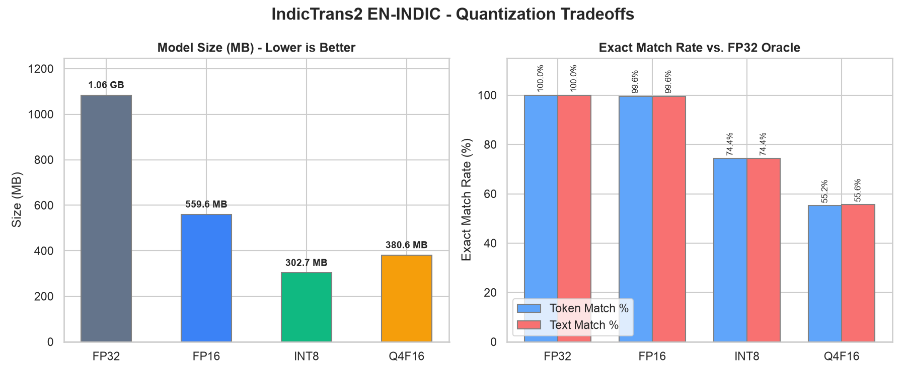
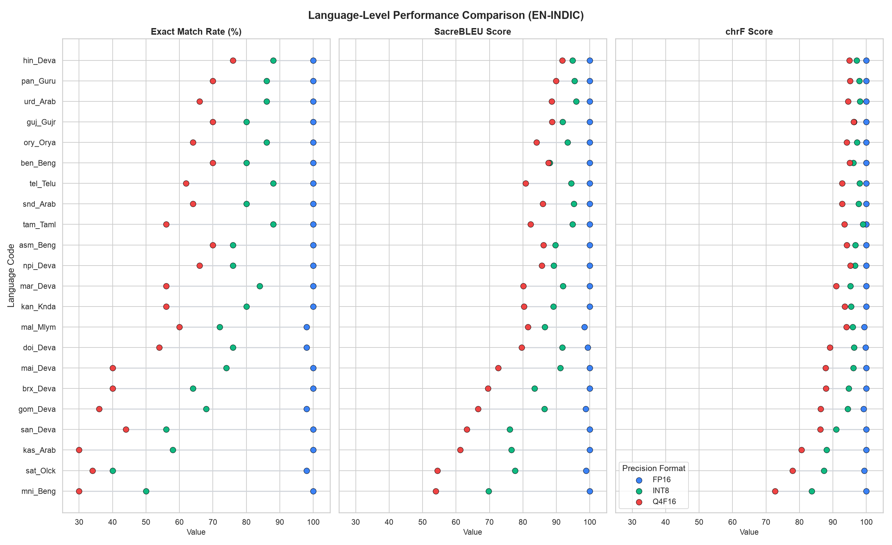
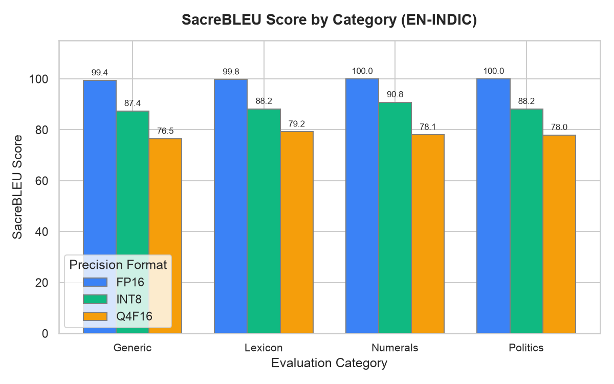
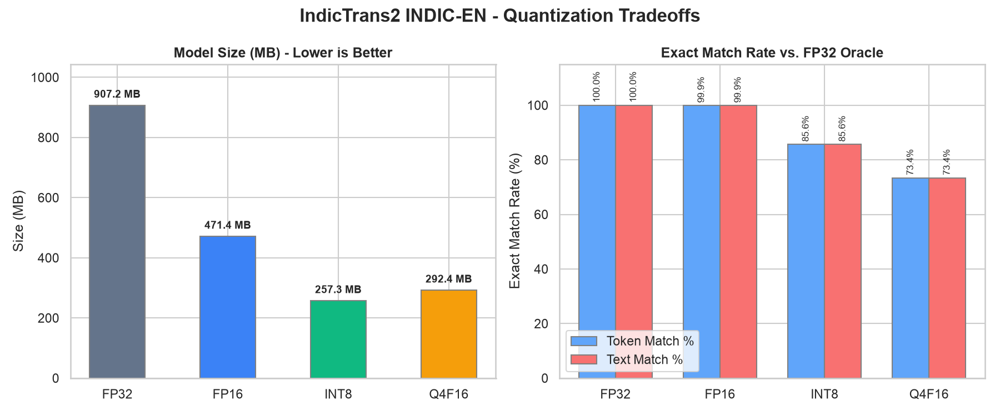
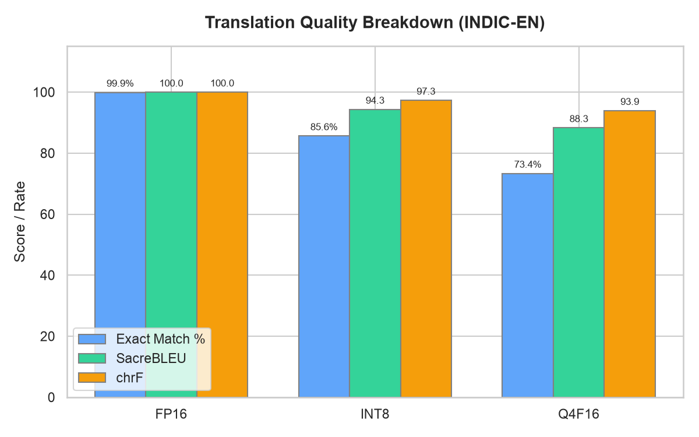
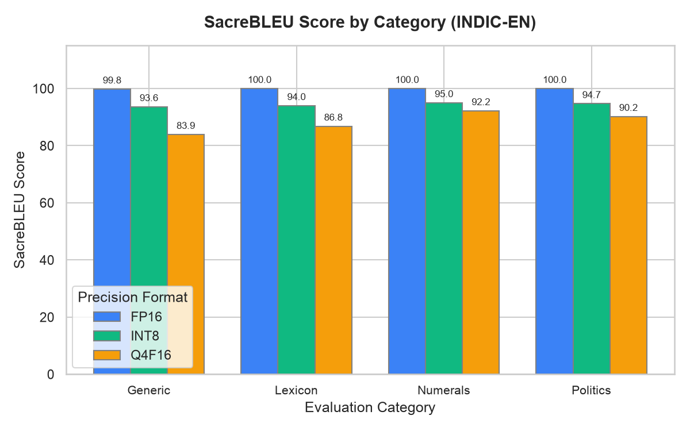
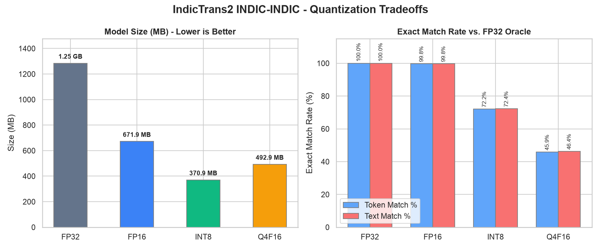
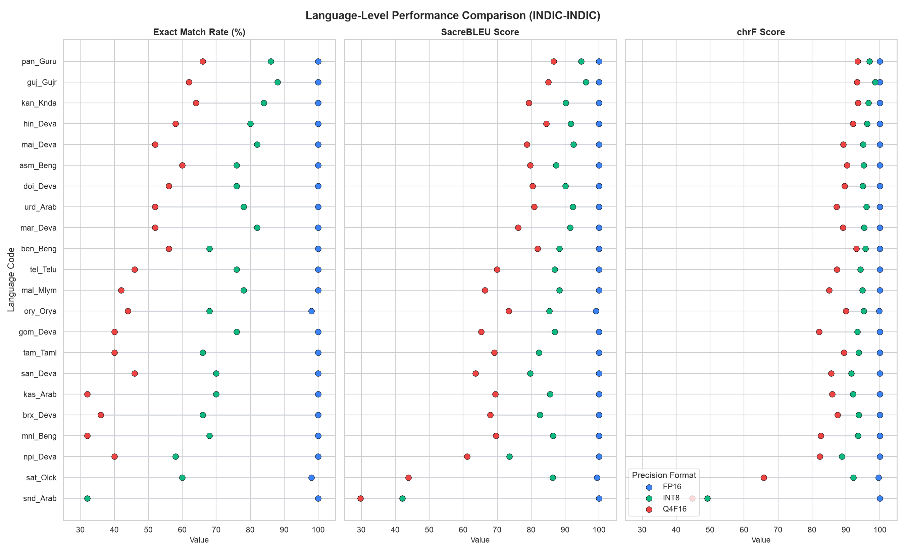
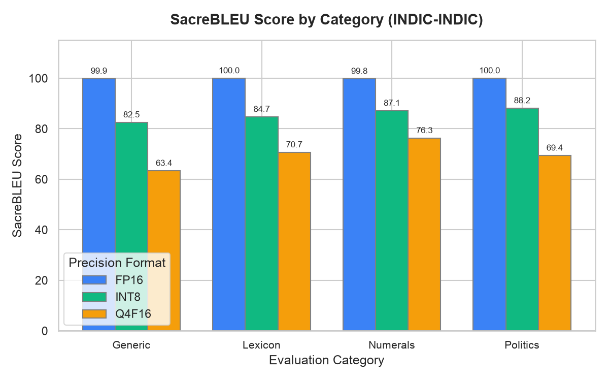

# IndicTrans2 ONNX Quantization & Parity Benchmarks

This document provides detailed performance, accuracy, and model size reports for the exported and quantized IndicTrans2 ONNX bundles.
Benchmarks are computed against the **FP32 ONNX Oracle** (which matches the PyTorch model at ≥ 99.0% token parity) on direction-specific evaluation fixtures.

## EN-INDIC Model Performance

### Overall Comparison

| Format | Model Size | Exact Match (Token) | Exact Match (Text) | SacreBLEU (Raw) | SacreBLEU (Mixed) | Latency (Mean) | Speedup vs. FP32 |
| :--- | :--- | :--- | :--- | :--- | :--- | :--- | :--- |
| FP32 | 1.06 GB | 100.00% | 100.00% | 100.00 | 100.00 | 18.3 ms | 1.000x |
| FP16 | 559.6 MB | 99.64% | 99.64% | 100.00 | 99.79 | 24.8 ms | 0.736x |
| INT8 | 302.7 MB | 74.36% | 74.36% | 90.44 | 88.85 | 13.2 ms | 1.594x |
| Q4F16 | 380.6 MB | 55.18% | 55.64% | 81.13 | 78.11 | 27.3 ms | 0.705x |

### Language-Level Performance

| Language Code | FP16 Match | FP16 BLEU | INT8 Match | INT8 BLEU | Q4F16 Match | Q4F16 BLEU |
| :--- | :--- | :--- | :--- | :--- | :--- | :--- |
| **asm_Beng** | 100.0% | 100.00 | 76.0% | 89.71 | 70.0% | 86.19 |
| **ben_Beng** | 100.0% | 100.00 | 80.0% | 88.06 | 70.0% | 87.64 |
| **brx_Deva** | 100.0% | 100.00 | 64.0% | 83.46 | 40.0% | 69.57 |
| **doi_Deva** | 98.0% | 99.36 | 76.0% | 91.78 | 54.0% | 79.59 |
| **gom_Deva** | 98.0% | 98.75 | 68.0% | 86.40 | 36.0% | 66.58 |
| **guj_Gujr** | 100.0% | 100.00 | 80.0% | 91.88 | 70.0% | 88.75 |
| **hin_Deva** | 100.0% | 100.00 | 88.0% | 94.79 | 76.0% | 91.75 |
| **kan_Knda** | 100.0% | 100.00 | 80.0% | 89.15 | 56.0% | 80.30 |
| **kas_Arab** | 100.0% | 100.00 | 58.0% | 76.57 | 30.0% | 61.28 |
| **mai_Deva** | 100.0% | 100.00 | 74.0% | 91.17 | 40.0% | 72.57 |
| **mal_Mlym** | 98.0% | 98.35 | 72.0% | 86.51 | 60.0% | 81.49 |
| **mar_Deva** | 100.0% | 100.00 | 84.0% | 91.92 | 56.0% | 80.08 |
| **mni_Beng** | 100.0% | 100.00 | 50.0% | 69.72 | 30.0% | 53.98 |
| **npi_Deva** | 100.0% | 100.00 | 76.0% | 89.17 | 66.0% | 85.66 |
| **ory_Orya** | 100.0% | 100.00 | 86.0% | 93.32 | 64.0% | 84.09 |
| **pan_Guru** | 100.0% | 100.00 | 86.0% | 95.40 | 70.0% | 89.89 |
| **san_Deva** | 100.0% | 100.00 | 56.0% | 76.08 | 44.0% | 63.21 |
| **sat_Olck** | 98.0% | 98.93 | 40.0% | 77.68 | 34.0% | 54.40 |
| **snd_Arab** | 100.0% | 100.00 | 80.0% | 95.26 | 64.0% | 85.93 |
| **tam_Taml** | 100.0% | 100.00 | 88.0% | 94.79 | 56.0% | 82.30 |
| **tel_Telu** | 100.0% | 100.00 | 88.0% | 94.39 | 62.0% | 80.77 |
| **urd_Arab** | 100.0% | 100.00 | 86.0% | 95.94 | 66.0% | 88.59 |

### Category-Level Performance

| Category | FP16 Match | FP16 BLEU | INT8 Match | INT8 BLEU | Q4F16 Match | Q4F16 BLEU |
| :--- | :--- | :--- | :--- | :--- | :--- | :--- |
| **Generic** | 98.95% | 99.40 | 71.68% | 87.36 | 51.75% | 76.46 |
| **Lexicon** | 99.62% | 99.77 | 72.73% | 88.24 | 51.89% | 79.25 |
| **Numerals** | 100.00% | 100.00 | 76.89% | 90.84 | 60.61% | 78.06 |
| **Politics** | 100.00% | 100.00 | 76.22% | 88.17 | 56.64% | 77.97 |

---
## INDIC-EN Model Performance

### Overall Comparison

| Format | Model Size | Exact Match (Token) | Exact Match (Text) | SacreBLEU (Raw) | SacreBLEU (Mixed) | Latency (Mean) | Speedup vs. FP32 |
| :--- | :--- | :--- | :--- | :--- | :--- | :--- | :--- |
| FP32 | 907.2 MB | 100.00% | 100.00% | 100.00 | 100.00 | 12.2 ms | 1.000x |
| FP16 | 471.4 MB | 99.91% | 99.91% | 99.96 | 99.96 | 14.3 ms | 0.849x |
| INT8 | 257.3 MB | 85.64% | 85.64% | 94.34 | 94.34 | 10.1 ms | 1.171x |
| Q4F16 | 292.4 MB | 73.36% | 73.36% | 88.31 | 88.31 | 15.8 ms | 0.742x |

### Language-Level Performance

| Language Code | FP16 Match | FP16 BLEU | INT8 Match | INT8 BLEU | Q4F16 Match | Q4F16 BLEU |
| :--- | :--- | :--- | :--- | :--- | :--- | :--- |
| **eng_Latn** | 99.9% | 99.96 | 85.6% | 94.34 | 73.4% | 88.31 |

### Category-Level Performance

| Category | FP16 Match | FP16 BLEU | INT8 Match | INT8 BLEU | Q4F16 Match | Q4F16 BLEU |
| :--- | :--- | :--- | :--- | :--- | :--- | :--- |
| **Generic** | 99.65% | 99.82 | 84.62% | 93.64 | 67.13% | 83.93 |
| **Lexicon** | 100.00% | 100.00 | 83.71% | 94.00 | 65.91% | 86.83 |
| **Numerals** | 100.00% | 100.00 | 87.50% | 95.02 | 79.92% | 92.22 |
| **Politics** | 100.00% | 100.00 | 86.71% | 94.70 | 80.42% | 90.23 |

---
## INDIC-INDIC Model Performance

### Overall Comparison

| Format | Model Size | Exact Match (Token) | Exact Match (Text) | SacreBLEU (Raw) | SacreBLEU (Mixed) | Latency (Mean) | Speedup vs. FP32 |
| :--- | :--- | :--- | :--- | :--- | :--- | :--- | :--- |
| FP32 | 1.25 GB | 100.00% | 100.00% | 100.00 | 100.00 | 23.0 ms | 1.000x |
| FP16 | 671.9 MB | 99.82% | 99.82% | 100.00 | 99.92 | 27.4 ms | 0.840x |
| INT8 | 370.9 MB | 72.18% | 72.36% | 87.13 | 85.73 | 16.5 ms | 1.475x |
| Q4F16 | 492.9 MB | 45.91% | 46.36% | 71.64 | 70.05 | 28.3 ms | 0.829x |

### Language-Level Performance

| Language Code | FP16 Match | FP16 BLEU | INT8 Match | INT8 BLEU | Q4F16 Match | Q4F16 BLEU |
| :--- | :--- | :--- | :--- | :--- | :--- | :--- |
| **asm_Beng** | 100.0% | 100.00 | 76.0% | 87.32 | 60.0% | 79.68 |
| **ben_Beng** | 100.0% | 100.00 | 68.0% | 88.34 | 56.0% | 81.85 |
| **brx_Deva** | 100.0% | 100.00 | 66.0% | 82.54 | 36.0% | 67.98 |
| **doi_Deva** | 100.0% | 100.00 | 76.0% | 90.11 | 56.0% | 80.42 |
| **gom_Deva** | 100.0% | 100.00 | 76.0% | 86.95 | 40.0% | 65.26 |
| **guj_Gujr** | 100.0% | 100.00 | 88.0% | 96.16 | 62.0% | 85.03 |
| **hin_Deva** | 100.0% | 100.00 | 80.0% | 91.64 | 58.0% | 84.45 |
| **kan_Knda** | 100.0% | 100.00 | 84.0% | 90.20 | 64.0% | 79.35 |
| **kas_Arab** | 100.0% | 100.00 | 70.0% | 85.53 | 32.0% | 69.48 |
| **mai_Deva** | 100.0% | 100.00 | 82.0% | 92.47 | 52.0% | 78.70 |
| **mal_Mlym** | 100.0% | 100.00 | 78.0% | 88.36 | 42.0% | 66.38 |
| **mar_Deva** | 100.0% | 100.00 | 82.0% | 91.51 | 52.0% | 76.19 |
| **mni_Beng** | 100.0% | 100.00 | 68.0% | 86.41 | 32.0% | 69.68 |
| **npi_Deva** | 100.0% | 100.00 | 58.0% | 73.60 | 40.0% | 61.15 |
| **ory_Orya** | 98.0% | 99.06 | 68.0% | 85.31 | 44.0% | 73.37 |
| **pan_Guru** | 100.0% | 100.00 | 86.0% | 94.72 | 66.0% | 86.62 |
| **san_Deva** | 100.0% | 100.00 | 70.0% | 79.70 | 46.0% | 63.61 |
| **sat_Olck** | 98.0% | 99.35 | 60.0% | 86.30 | 24.0% | 43.83 |
| **snd_Arab** | 100.0% | 100.00 | 32.0% | 42.11 | 10.0% | 29.80 |
| **tam_Taml** | 100.0% | 100.00 | 66.0% | 82.31 | 40.0% | 69.16 |
| **tel_Telu** | 100.0% | 100.00 | 76.0% | 86.94 | 46.0% | 69.91 |
| **urd_Arab** | 100.0% | 100.00 | 78.0% | 92.24 | 52.0% | 80.86 |

### Category-Level Performance

| Category | FP16 Match | FP16 BLEU | INT8 Match | INT8 BLEU | Q4F16 Match | Q4F16 BLEU |
| :--- | :--- | :--- | :--- | :--- | :--- | :--- |
| **Generic** | 99.65% | 99.86 | 67.83% | 82.54 | 44.41% | 63.36 |
| **Lexicon** | 100.00% | 100.00 | 68.94% | 84.70 | 44.32% | 70.68 |
| **Numerals** | 99.62% | 99.80 | 73.48% | 87.13 | 46.21% | 76.31 |
| **Politics** | 100.00% | 100.00 | 78.32% | 88.15 | 48.60% | 69.40 |

---