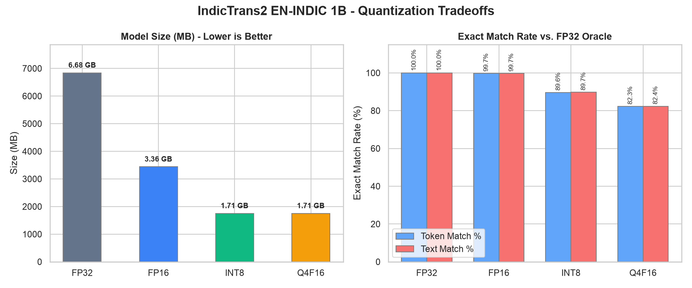
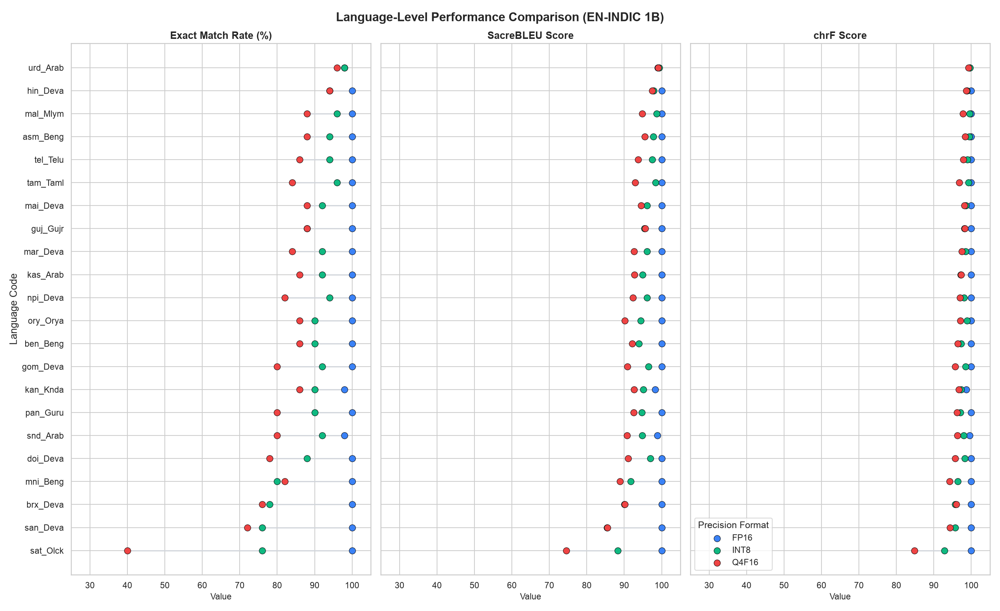
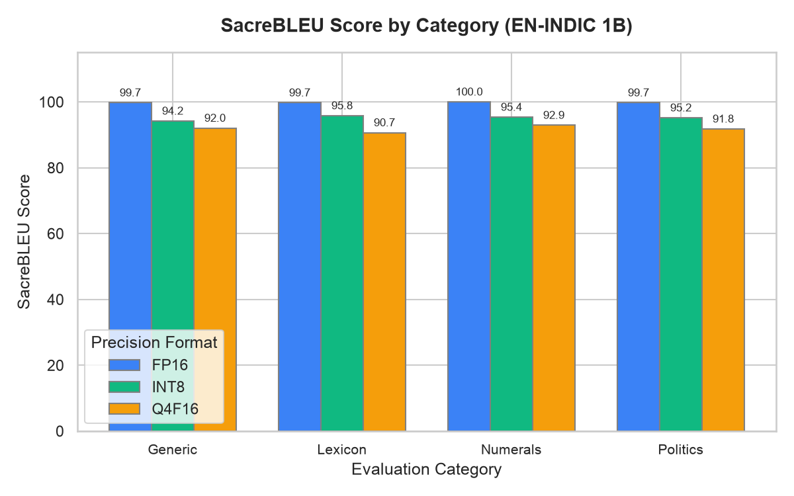
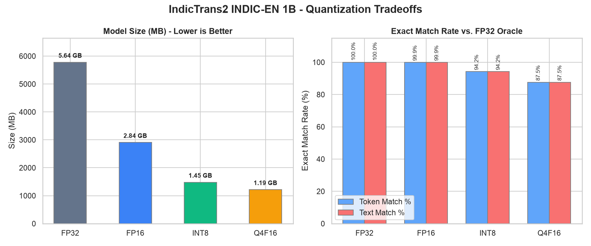
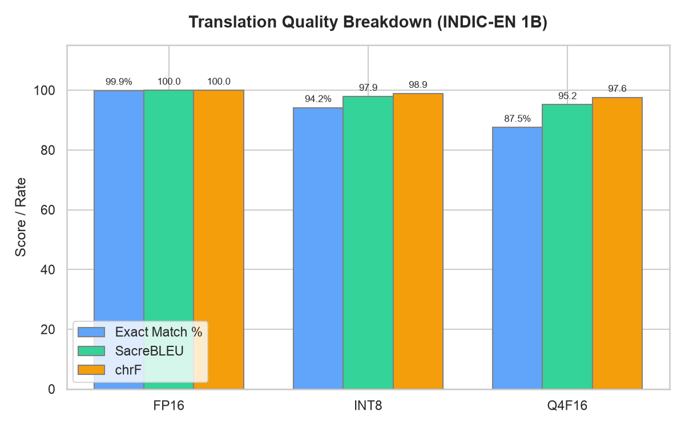
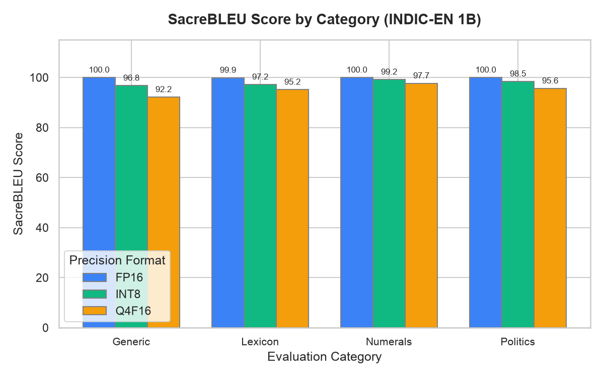
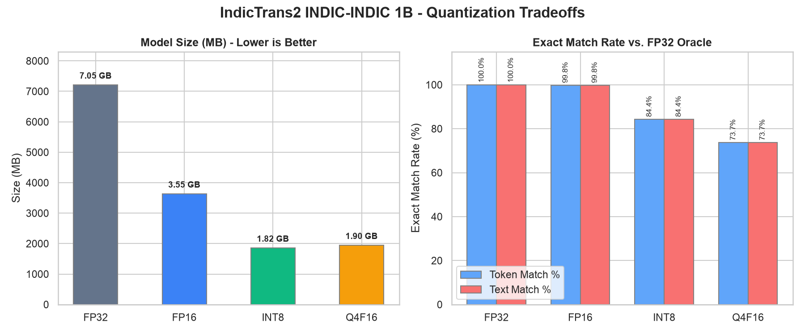
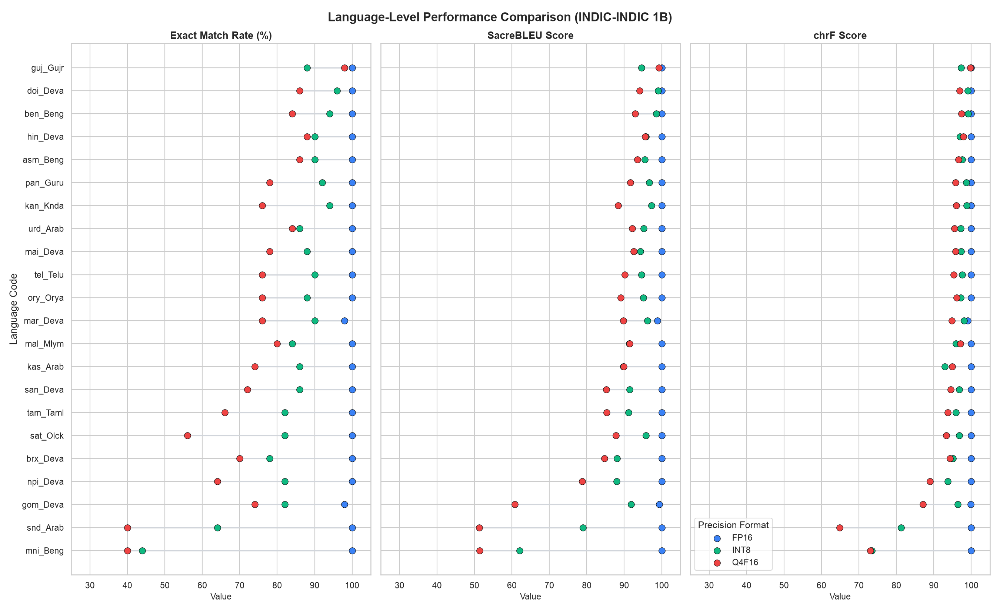
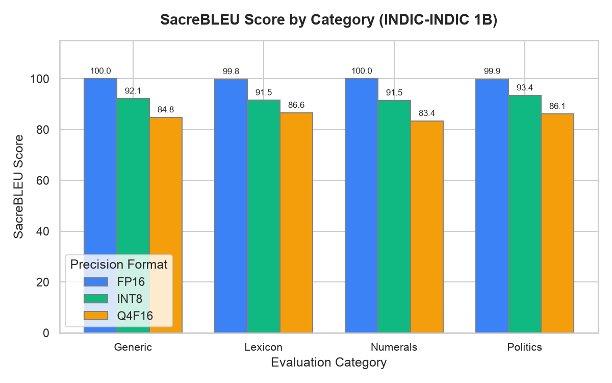

# IndicTrans2 1B ONNX Quantization & Parity Benchmarks

This document provides detailed performance, accuracy, and model size reports for the exported and quantized IndicTrans2 ONNX bundles.
Benchmarks are computed against the **FP32 ONNX Oracle** (which matches the PyTorch model at ≥ 99.0% token parity) on direction-specific evaluation fixtures.

## EN-INDIC Model Performance

### Overall Comparison

| Format | Model Size | Exact Match (Token) | Exact Match (Text) | SacreBLEU (Raw) | SacreBLEU (Mixed) | Latency (Mean) | Speedup vs. FP32 |
| :----- | :--------- | :------------------ | :----------------- | :-------------- | :---------------- | :------------- | :--------------- |
| FP32   | 6.68 GB    | 100.00%             | 100.00%            | 100.00          | 100.00            | 244.4 ms       | 1.000x           |
| FP16   | 3.36 GB    | 99.73%              | 99.73%             | 100.00          | 99.81             | 259.8 ms       | 0.941x           |
| INT8   | 1.71 GB    | 89.64%              | 89.73%             | 95.69           | 95.32             | 112.6 ms       | 2.228x           |
| Q4F16  | 1.71 GB    | 82.27%              | 82.36%             | 92.55           | 91.91             | 143.3 ms       | 1.673x           |

### Language-Level Performance

| Language Code | FP16 Match | FP16 BLEU | INT8 Match | INT8 BLEU | Q4F16 Match | Q4F16 BLEU |
| :------------ | :--------- | :-------- | :--------- | :-------- | :---------- | :--------- |
| **asm_Beng**  | 100.0%     | 100.00    | 94.0%      | 97.76     | 88.0%       | 95.48      |
| **ben_Beng**  | 100.0%     | 100.00    | 90.0%      | 93.93     | 86.0%       | 92.10      |
| **brx_Deva**  | 100.0%     | 100.00    | 78.0%      | 90.04     | 76.0%       | 90.17      |
| **doi_Deva**  | 100.0%     | 100.00    | 88.0%      | 97.01     | 78.0%       | 91.01      |
| **gom_Deva**  | 100.0%     | 100.00    | 92.0%      | 96.50     | 80.0%       | 90.88      |
| **guj_Gujr**  | 100.0%     | 100.00    | 88.0%      | 95.35     | 88.0%       | 95.64      |
| **hin_Deva**  | 100.0%     | 100.00    | 94.0%      | 97.83     | 94.0%       | 97.45      |
| **kan_Knda**  | 98.0%      | 98.28     | 90.0%      | 95.13     | 86.0%       | 92.63      |
| **kas_Arab**  | 100.0%     | 100.00    | 92.0%      | 94.91     | 86.0%       | 92.77      |
| **mai_Deva**  | 100.0%     | 100.00    | 92.0%      | 96.05     | 88.0%       | 94.50      |
| **mal_Mlym**  | 100.0%     | 100.00    | 96.0%      | 98.62     | 88.0%       | 94.83      |
| **mar_Deva**  | 100.0%     | 100.00    | 92.0%      | 96.04     | 84.0%       | 92.58      |
| **mni_Beng**  | 100.0%     | 100.00    | 80.0%      | 91.76     | 82.0%       | 88.86      |
| **npi_Deva**  | 100.0%     | 100.00    | 94.0%      | 96.06     | 82.0%       | 92.31      |
| **ory_Orya**  | 100.0%     | 100.00    | 90.0%      | 94.45     | 86.0%       | 90.18      |
| **pan_Guru**  | 100.0%     | 100.00    | 90.0%      | 94.75     | 80.0%       | 92.51      |
| **san_Deva**  | 100.0%     | 100.00    | 76.0%      | 85.44     | 72.0%       | 85.51      |
| **sat_Olck**  | 100.0%     | 100.00    | 76.0%      | 88.23     | 40.0%       | 74.49      |
| **snd_Arab**  | 98.0%      | 98.83     | 92.0%      | 94.79     | 80.0%       | 90.79      |
| **tam_Taml**  | 100.0%     | 100.00    | 96.0%      | 98.35     | 84.0%       | 92.95      |
| **tel_Telu**  | 100.0%     | 100.00    | 94.0%      | 97.51     | 86.0%       | 93.72      |
| **urd_Arab**  | 98.0%      | 98.92     | 98.0%      | 99.36     | 96.0%       | 99.01      |

### Category-Level Performance

| Category     | FP16 Match | FP16 BLEU | INT8 Match | INT8 BLEU | Q4F16 Match | Q4F16 BLEU |
| :----------- | :--------- | :-------- | :--------- | :-------- | :---------- | :--------- |
| **Generic**  | 99.65%     | 99.74     | 88.11%     | 94.19     | 81.47%      | 92.03      |
| **Lexicon**  | 99.62%     | 99.74     | 90.53%     | 95.81     | 79.55%      | 90.65      |
| **Numerals** | 100.00%    | 100.00    | 89.77%     | 95.36     | 83.71%      | 92.91      |
| **Politics** | 99.65%     | 99.74     | 90.21%     | 95.16     | 84.27%      | 91.78      |

---
## INDIC-EN Model Performance

### Overall Comparison

| Format | Model Size | Exact Match (Token) | Exact Match (Text) | SacreBLEU (Raw) | SacreBLEU (Mixed) | Latency (Mean) | Speedup vs. FP32 |
| :----- | :--------- | :------------------ | :----------------- | :-------------- | :---------------- | :------------- | :--------------- |
| FP32   | 5.64 GB    | 100.00%             | 100.00%            | 100.00          | 100.00            | 171.8 ms       | 1.000x           |
| FP16   | 2.84 GB    | 99.91%              | 99.91%             | 99.98           | 99.98             | 180.5 ms       | 0.952x           |
| INT8   | 1.45 GB    | 94.18%              | 94.18%             | 97.94           | 97.94             | 76.4 ms        | 2.196x           |
| Q4F16  | 1.19 GB    | 87.55%              | 87.55%             | 95.17           | 95.17             | 85.5 ms        | 1.962x           |

### Language-Level Performance

| Language Code | FP16 Match | FP16 BLEU | INT8 Match | INT8 BLEU | Q4F16 Match | Q4F16 BLEU |
| :------------ | :--------- | :-------- | :--------- | :-------- | :---------- | :--------- |
| **eng_Latn**  | 99.9%      | 99.98     | 94.2%      | 97.94     | 87.5%       | 95.17      |

### Category-Level Performance

| Category     | FP16 Match | FP16 BLEU | INT8 Match | INT8 BLEU | Q4F16 Match | Q4F16 BLEU |
| :----------- | :--------- | :-------- | :--------- | :-------- | :---------- | :--------- |
| **Generic**  | 100.00%    | 100.00    | 91.61%     | 96.78     | 79.72%      | 92.19      |
| **Lexicon**  | 99.62%     | 99.92     | 91.29%     | 97.20     | 87.12%      | 95.18      |
| **Numerals** | 100.00%    | 100.00    | 97.35%     | 99.20     | 93.56%      | 97.68      |
| **Politics** | 100.00%    | 100.00    | 96.50%     | 98.45     | 90.21%      | 95.64      |

---
## INDIC-INDIC Model Performance

### Overall Comparison

| Format | Model Size | Exact Match (Token) | Exact Match (Text) | SacreBLEU (Raw) | SacreBLEU (Mixed) | Latency (Mean) | Speedup vs. FP32 |
| :----- | :--------- | :------------------ | :----------------- | :-------------- | :---------------- | :------------- | :--------------- |
| FP32   | 7.05 GB    | 100.00%             | 100.00%            | 100.00          | 100.00            | 251.7 ms       | 1.000x           |
| FP16   | 3.55 GB    | 99.82%              | 99.82%             | 100.00          | 99.93             | 270.4 ms       | 0.931x           |
| INT8   | 1.82 GB    | 84.36%              | 84.36%             | 94.61           | 92.19             | 109.5 ms       | 2.292x           |
| Q4F16  | 1.90 GB    | 73.73%              | 73.73%             | 89.81           | 86.00             | 151.0 ms       | 1.666x           |

### Language-Level Performance

| Language Code | FP16 Match | FP16 BLEU | INT8 Match | INT8 BLEU | Q4F16 Match | Q4F16 BLEU |
| :------------ | :--------- | :-------- | :--------- | :-------- | :---------- | :--------- |
| **asm_Beng**  | 100.0%     | 100.00    | 90.0%      | 95.50     | 86.0%       | 93.55      |
| **ben_Beng**  | 100.0%     | 100.00    | 94.0%      | 98.60     | 84.0%       | 92.88      |
| **brx_Deva**  | 100.0%     | 100.00    | 78.0%      | 88.07     | 70.0%       | 84.75      |
| **doi_Deva**  | 100.0%     | 100.00    | 96.0%      | 99.04     | 86.0%       | 94.10      |
| **gom_Deva**  | 98.0%      | 99.40     | 82.0%      | 91.84     | 74.0%       | 60.77      |
| **guj_Gujr**  | 100.0%     | 100.00    | 88.0%      | 94.56     | 98.0%       | 99.26      |
| **hin_Deva**  | 100.0%     | 100.00    | 90.0%      | 95.75     | 88.0%       | 95.56      |
| **kan_Knda**  | 100.0%     | 100.00    | 94.0%      | 97.27     | 76.0%       | 88.37      |
| **kas_Arab**  | 100.0%     | 100.00    | 86.0%      | 89.79     | 74.0%       | 89.85      |
| **mai_Deva**  | 100.0%     | 100.00    | 88.0%      | 94.33     | 78.0%       | 92.49      |
| **mal_Mlym**  | 100.0%     | 100.00    | 84.0%      | 91.32     | 80.0%       | 91.43      |
| **mar_Deva**  | 98.0%      | 98.85     | 90.0%      | 96.16     | 76.0%       | 89.77      |
| **mni_Beng**  | 100.0%     | 100.00    | 44.0%      | 62.03     | 40.0%       | 51.39      |
| **npi_Deva**  | 100.0%     | 100.00    | 82.0%      | 87.95     | 64.0%       | 78.79      |
| **ory_Orya**  | 100.0%     | 100.00    | 88.0%      | 95.09     | 76.0%       | 89.09      |
| **pan_Guru**  | 100.0%     | 100.00    | 92.0%      | 96.67     | 78.0%       | 91.65      |
| **san_Deva**  | 100.0%     | 100.00    | 86.0%      | 91.49     | 72.0%       | 85.19      |
| **sat_Olck**  | 100.0%     | 100.00    | 82.0%      | 95.78     | 56.0%       | 87.74      |
| **snd_Arab**  | 100.0%     | 100.00    | 64.0%      | 79.01     | 40.0%       | 51.30      |
| **tam_Taml**  | 100.0%     | 100.00    | 82.0%      | 91.16     | 66.0%       | 85.32      |
| **tel_Telu**  | 100.0%     | 100.00    | 90.0%      | 94.65     | 76.0%       | 90.11      |
| **urd_Arab**  | 100.0%     | 100.00    | 86.0%      | 95.20     | 84.0%       | 92.18      |

### Category-Level Performance

| Category     | FP16 Match | FP16 BLEU | INT8 Match | INT8 BLEU | Q4F16 Match | Q4F16 BLEU |
| :----------- | :--------- | :-------- | :--------- | :-------- | :---------- | :--------- |
| **Generic**  | 100.00%    | 100.00    | 85.66%     | 92.14     | 70.63%      | 84.77      |
| **Lexicon**  | 99.62%     | 99.82     | 82.58%     | 91.53     | 70.45%      | 86.59      |
| **Numerals** | 100.00%    | 100.00    | 81.82%     | 91.47     | 74.62%      | 83.36      |
| **Politics** | 99.65%     | 99.90     | 87.06%     | 93.40     | 79.02%      | 86.13      |

---