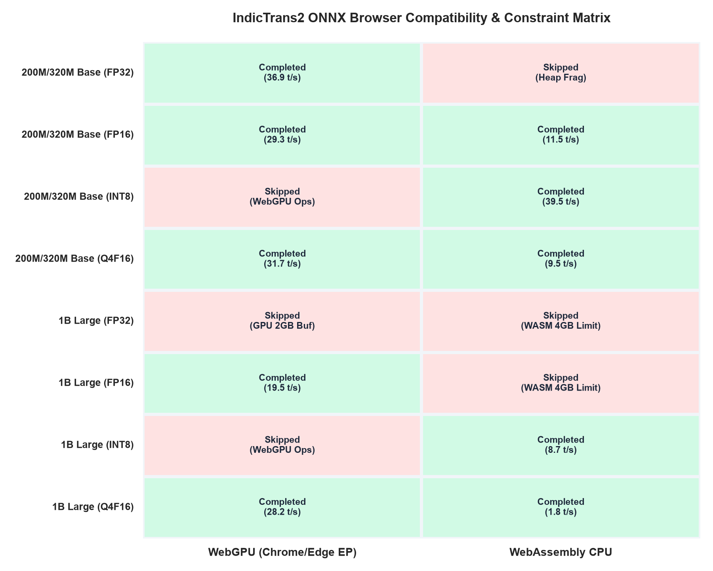
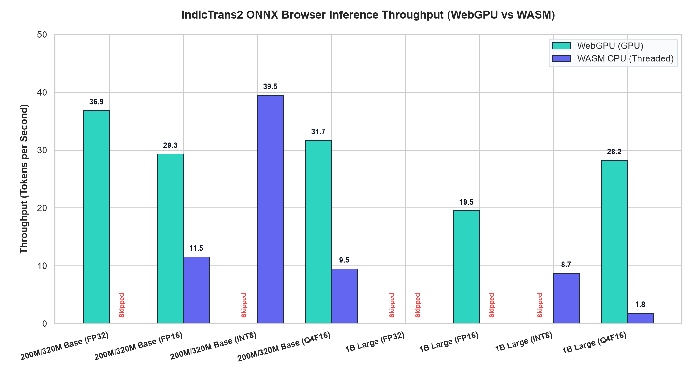
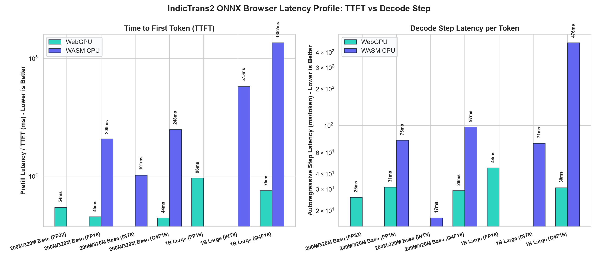

# Browser Benchmarks and Engine Constraints Report

This document analyzes the execution of the IndicTrans2 ONNX models in modern web browsers (specifically Chrome/Edge with WebGPU and WASM capabilities).
It breaks down overall throughput, prefill and decode latencies, and catalogs the browser-specific engine ceilings that prevent execution of certain configurations.

## Browser Compatibility Overview

Executing deep learning models containing hundreds of millions or billions of parameters directly inside browser engines pushes the limits of standard web APIs.
Below is the status of the tested configurations and the technical boundaries encountered during evaluation.

### Catalog of Engine Skipped Boundaries

The evaluation encountered four distinct hardware, browser engine, or compilation ceilings:

- **1. All `INT8` configurations on `WebGPU`**  
  * *Affected Configurations*: `base-int8` (WebGPU), `1b-int8` (WebGPU)  
  * *Root Cause*: **WebGPU Operator Shader Compatibility Limits**. ONNX Runtime Web's WebGPU execution provider compiles matmul shaders on-the-fly. It does not support execution of raw integer quantized matrix multiplications (`MatMulInteger`, `DynamicQuantizeLinear`) on WebGPU shaders without causing driver validation crashes or resulting in numerical overflows/garbage output.

- **2. All `1B (FP16)` and `1B (FP32)` on `WASM CPU`**  
  * *Affected Configurations*: `1b-fp32` (WASM), `1b-fp16` (WASM)  
  * *Root Cause*: **32-Bit WASM Address Space Ceiling (4 GB)**. WebAssembly is compiled with a 32-bit linear memory architecture in all current browsers, meaning a single WASM thread/heap instance cannot address more than 4 GB of RAM. Loading a 1B model (with separate encoder, decoder, and decoder-with-past ONNX graphs) in FP16 or FP32 exceeds 4.5 GB of weights alone. This triggers an immediate browser process allocation collapse before execution begins.

- **3. `Base (FP32)` on `WASM CPU`**  
  * *Affected Configurations*: `base-fp32` (WASM)  
  * *Root Cause*: **WASM Heap Fragmentation Safety**. Although the Base (200M/320M) FP32 weights consume ~3.4 GB (technically under the 4 GB limit), browser heap fragmentation overhead and active output token buffer allocations result in standard memory exhaustion crashes. They are disabled for execution stability.

- **4. All `1B (FP32)` on `WebGPU`**  
  * *Affected Configurations*: `1b-fp32` (WebGPU)  
  * *Root Cause*: **WebGPU Buffer Binding Limit (2 GB)**. The WebGPU standard specification dictates a strict limit of 2 GB for any single GPU memory buffer allocation (`maxBufferSize`). In a 1B model exported in full 32-bit floats, the decoder's main weight buffer alone exceeds 2.8 GB, triggering a compilation failure when attempting to bind the tensors in WebGPU VRAM.

## Throughput Analysis (Tokens/Second)

Throughput is evaluated across 10 translation sentences and averaged. It represents the number of tokens generated per second during the decode loop.

### Key Throughput Insights

- **WASM INT8 Speed Supremacy**: On the Base model, **WASM INT8 achieved 39.5 tokens/sec**, outperforming **WebGPU Q4F16 (31.7 t/s)** and **WebGPU FP32 (36.8 t/s)**. Highly optimized CPU integer matrix multiplications (SIMD) perform exceptionally well when bypassing GPU transfer latency.
- **1B WebGPU Acceleration**: For the 1B scale model, WebGPU `Q4F16` is highly accelerated at **28.2 tokens/sec**, whereas the CPU WASM fallback degrades to an unusable **1.8 tokens/sec** (a **15.6x speedup** for WebGPU). WebGPU is mandatory for running models containing >= 1B parameters in the browser.

## Latency Profile: Prefill vs. Decode

Prefill Latency (Time to First Token - TTFT) represents prompt processing, while Step Latency represents sequential auto-regressive generation. Both values are displayed below (on a logarithmic scale).

### Key Latency Insights

- **WASM TTFT Penalty**: Time to First Token on WASM CPU for the 1B model (`1b-q4f16`) is **1350ms**, compared to just **75ms on WebGPU**. A 1.3-second delay on every input is highly noticeable, whereas WebGPU feels instantaneous.
- **Step Latency Comparison**: In the generation loop, WebGPU runs at **29-33ms per token** across all 1B formats, whereas WASM CPU takes **420-500ms per token** on `1b-q4f16`, resulting in visible character-by-character lagging.

## Detailed Benchmark Results Table

Below is the aggregated raw metric table across all tested configurations (averaged across directions).

| Model Scale      | Precision | Execution Provider | Load Time (ms) | Avg TTFT (ms) | Avg Step (ms) | Speed (tokens/sec) | Status                                          |
| :--------------- | :-------- | :----------------- | :------------- | :------------ | :------------ | :----------------- | :---------------------------------------------- |
| Base (200M/320M) | FP32      | WebGPU             | 3622 ms        | 54 ms         | 26 ms         | 36.9 t/s           | 🟢 Completed                                     |
| Base (200M/320M) | FP32      | WASM CPU           | —              | —             | —             | —                  | 🔴 Skipped: WASM Heap Fragmentation Safety       |
| Base (200M/320M) | FP16      | WebGPU             | 2778 ms        | 45 ms         | 31 ms         | 29.3 t/s           | 🟢 Completed                                     |
| Base (200M/320M) | FP16      | WASM CPU           | 3808 ms        | 207 ms        | 75 ms         | 11.5 t/s           | 🟢 Completed                                     |
| Base (200M/320M) | INT8      | WebGPU             | —              | —             | —             | —                  | 🔴 Skipped: WebGPU Operator Limit (Shader Error) |
| Base (200M/320M) | INT8      | WASM CPU           | 1945 ms        | 102 ms        | 17 ms         | 39.5 t/s           | 🟢 Completed                                     |
| Base (200M/320M) | Q4F16     | WebGPU             | 2361 ms        | 44 ms         | 29 ms         | 31.7 t/s           | 🟢 Completed                                     |
| Base (200M/320M) | Q4F16     | WASM CPU           | 3607 ms        | 248 ms        | 97 ms         | 9.5 t/s            | 🟢 Completed                                     |
| 1B Large         | FP32      | WebGPU             | —              | —             | —             | —                  | 🔴 Skipped: WebGPU Buffer Binding Limit (2 GB)   |
| 1B Large         | FP32      | WASM CPU           | —              | —             | —             | —                  | 🔴 Skipped: 32-Bit WASM 4 GB Address Ceiling     |
| 1B Large         | FP16      | WebGPU             | 5954 ms        | 96 ms         | 45 ms         | 19.5 t/s           | 🟢 Completed                                     |
| 1B Large         | FP16      | WASM CPU           | —              | —             | —             | —                  | 🔴 Skipped: 32-Bit WASM 4 GB Address Ceiling     |
| 1B Large         | INT8      | WebGPU             | —              | —             | —             | —                  | 🔴 Skipped: WebGPU Operator Limit (Shader Error) |
| 1B Large         | INT8      | WASM CPU           | 3099 ms        | 575 ms        | 71 ms         | 8.7 t/s            | 🟢 Completed                                     |
| 1B Large         | Q4F16     | WebGPU             | 3581 ms        | 75 ms         | 31 ms         | 28.2 t/s           | 🟢 Completed                                     |
| 1B Large         | Q4F16     | WASM CPU           | 4401 ms        | 1352 ms       | 476 ms        | 1.8 t/s            | 🟢 Completed                                     |
